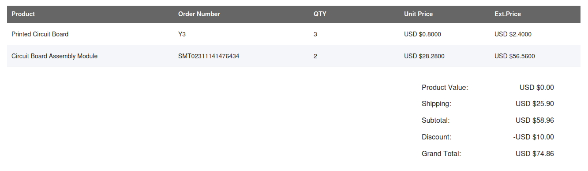

# Bill of Material
This includes a comprehensive list of all the individual electronic and non-electronic components used in the manufacture of the Prometheus Fire Alarm System. For an overall specification of the sensors, actuators and controllers; please refer to the [Technical Specifications](./Technical_Specifications.md) section.

1. [10uF Capacitors](<## 10uF Capacitors - Quantity 4>)
2. [0\.1uF Capacitors](<## 0.1uF Capacitors - Quantity 2>)
3. [10kΩ Resistors](<## 10kΩ Resistors - Quantity 7>)
4. [100Ω Resistors](<## 100Ω Resistors - Quantity 5>)
5. [220Ω Resistors](<## 220Ω Resistors - Quantity 2>)
6. [20kΩ Resistors](<## 20kΩ Resistors - Quantity 1>)
7. [2kΩ Resistors](<## 2kΩ Resistors - Quantity 1>)
8. [1N4001 Diode](<## 1N4001 Diode - Quantity 1>)
9. [Through Hole LED](<## Through Hole LED - Quantity 1>)
10. [LMS1585 Voltage Regulator](<## LMS1585 Voltage Regulator - Quantity 1>)
11. [LM7805 Voltage Regulator](<## LM7805 Voltage Regulator - Quantity 1>)
12. [XD549 ADC](<## XD549 ADC - Quantity 1>)
13. [MQ-135 Gas Sensor](<## MQ-135 Gas Sensor - Quantity 1>)
14. [DHT-11 Temperature/Humidity Sensor](<## DHT-11 Temperature/Humidity Sensor - Quantity 1>)
15. [IRLML 6246 MOSFET](<## IRLML 6246 MOSFET - Quantity 3>)
16. [TXS0108EQ Level Shifter](<## TXS0108EQ Level Shifter - Quantity 1>)
17. [SRD-05 Relay](<## SRD-05 Relay - Quantity 1>)
18. [CPE-222H Buzzer](<## CPE-222H Buzzer - Quantity 1>)
19. [DTS-62 Horizontal Switch](<## DTS-62 Vertical Switch - Quantity 1>)
20. [XKB DC-005 Barrel Jack Connector](<## XKB DC-005 Barrel Jack Connector - Quantity 1>)
21. [2x1 Molex Connector](<## 2x1 Molex Connector - Quantity 1>)
22. [1x13 Pin Header](<## 1x13 Pin Header - Quantity 1>)
23. [nRF 7002 DK Development Board](<## nRF 7002 DK Development Board - Quantity 1>)
24. [12V Power Supply with DC Barel Jack](<## 12V Power Supply with DC Barel Jack - Quantity 1>)
25. [Micro USB Cable](<## Micro USB Cable - Quantity 1>)
26. [1x13 Male to Female Ribbon Cable](<## 1x13 Male to Female Ribbon Cable - Quantity 1>)
27. [ZE-4F180 Valve with compatible tubing and spray end](<## ZE-4F180 Valve with compatible tubing and spray end - Quantity 1>)

## Cost Breakdown
The nRF 7002 DK was recieved from the hardware giveaway program saving me around $56.49. (Rs. 18, 189.30) The direct cost was only involved with PCB manufacturing, assembly and shipping. Overall, the cost breakdown is as follows.
- nRF 7002 DK: $0.00
- PCB Printing: $4.00
- Setup fee: $8.00
- Stencil: $1.50
- Components: $15.12
- Extended components fee: $25.48
- SMT Assembly: $0.46
- Hand-soldering labor fee: $3.50
- Manual Assembly: $0.96
- Refund: -$0.06

This adds a merchandise total of $58.96 (Rs. 18, 984.62)
- MERCHANDISE TOTAL: $58.96 (Rs. 18, 984.62)
- SHIPPING CHARGE: $25.90 (Rs. 8, 339.58)
- DISCOUNT: - $10.00 (Rs. 3, 219.92)
- ORDER TOTAL: $74.86 (Rs. 24, 104.28)

This finally gives a total of $74.86 (Rs. 24, 104.28). Adding government taxes of Rs. 8, 000 ($24.85) gives a final expense of $99.71 (Rs. 32, 104.28).
- ORDER TOTAL: $74.86 (Rs. 24, 104.28)
- GOVERNMENT TAXES: $24.85 (Rs. 8, 000)

- **FINAL DIRECT COST: $99.71 (Rs. 32, 104.28)**
> 
> Order details

## Bill of Material
### 10uF Capacitors - Quantity 4
These are mostly used in the PCB for voltage filtering. It is not important to have the exact values but 10uF would be the ideal value for these capacitors.
- Components: C1, C2, C4, C5
- Brand/Model: Yageo CC0805KKX5R6BB106
- Description: 10V 10uF X5R ±10% 0805 Multilayer Ceramic Capacitors MLCC - SMD/SMT ROHS
- Datasheet: [10V 10uF X5R ±10% 0805 Multilayer Ceramic Capacitors MLCC - SMD/SMT ROHS](<10V 10uF X5R ±10% 0805 Multilayer Ceramic Capacitors MLCC - SMD/SMT ROHS>)
- JLCPCB: [https://jlcpcb.com/partdetail/Yageo-CC0805KKX5R6BB106/C89832](<## https://jlcpcb.com/partdetail/Yageo-CC0805KKX5R6BB106/C89832>)

### 0\.1uF Capacitors - Quantity 2
These are recommended components to be used in the ADC. Refer to its datasheet for the layout.
- Components: C3, C6
- Brand/Model: Yageo CC0805ZRY5V8BB104
- Description: 25V 100nF Y5V -20%\~+80% 0805 Multilayer Ceramic Capacitors MLCC - SMD/SMT ROHS
- Datasheet: [https://datasheet.lcsc.com/lcsc/2008171233\_YAGEO-CC0805ZRY5V8BB104\_C519930.pdf](<## https://datasheet.lcsc.com/lcsc/2008171233_YAGEO-CC0805ZRY5V8BB104_C519930.pdf>)
- JLCPCB: [https://jlcpcb.com/partdetail/Yageo-CC0805ZRY5V8BB104/C519930](<https://jlcpcb.com/partdetail/Yageo-CC0805ZRY5V8BB104/C519930>)

### 10kΩ Resistors - Quantity 7
These are used for pull-down purposes at the gate of MOSFETS. This is an ideal value for this application.
- Components: R3, R7, R11, R12, R14, R17, R21
- Brand/Model: Yageo AC0805JR-0710KL
- Description: 125mW Thick Film Resistors ±100ppm/℃ ±5% 10kΩ 0805 Chip Resistor - Surface Mount ROHS
- Datasheet: [https://datasheet.lcsc.com/lcsc/2304140030\_YAGEO-AC0805JR-0710KL\_C138260.pdf](<## https://datasheet.lcsc.com/lcsc/2304140030_YAGEO-AC0805JR-0710KL_C138260.pdf>)
- JLCPCB: [https://jlcpcb.com/partdetail/Yageo-AC0805JR0710KL/C138260](<https://jlcpcb.com/partdetail/Yageo-AC0805JR0710KL/C138260>)

### 100Ω Resistors - Quantity 5
These are used to drive the gate of MOSFETS. This is an ideal value for this application.
- Components: R9, R10, R13, R16, R19
- Brand/Model: Yageo AC0805JR-7W100RL
- Description: 250mW Thick Film Resistors ±100ppm/℃ ±5% 100Ω 0805 Chip Resistor - Surface Mount ROHS
- Datasheet: [https://datasheet.lcsc.com/lcsc/2304140030\_YAGEO-AC0805JR-7W100RL\_C728002.pdf](<## https://datasheet.lcsc.com/lcsc/2304140030_YAGEO-AC0805JR-7W100RL_C728002.pdf>)
- JLCPCB: [https://jlcpcb.com/partdetail/Yageo-AC0805JR7W100RL/C728002](<https://jlcpcb.com/partdetail/Yageo-AC0805JR7W100RL/C728002>)

### 220Ω Resistors - Quantity 2
These are used to drive the 5V source of MOSFETS. This is an ideal value for this application.
- Components: R15, R18
- Brand/Model: Panasonic ERJ6ENF2200V
- Description: 125mW Thick Film Resistors ±100ppm/℃ ±1% 220Ω 0805 Chip Resistor - Surface Mount ROHS
- Datasheet: [https://jlcpcb.com/c27a378e-b8d6-4204-a609-b03341428117](<https://jlcpcb.com/c27a378e-b8d6-4204-a609-b03341428117>)
- JLCPCB: [https://jlcpcb.com/partdetail/Panasonic-ERJ6ENF2200V/C413269](<## https://jlcpcb.com/partdetail/Panasonic-ERJ6ENF2200V/C413269>)

### 20kΩ Resistors - Quantity 1
This is an optional component used in case the ADC doesn't work.
- Components: R4
- Brand/Model: Yageo RC0805FR-0720KL
- Description: 125mW Thick Film Resistors ±100ppm/℃ ±1% 20kΩ 0805 Chip Resistor - Surface Mount ROHS
- Datasheet: [https://datasheet.lcsc.com/lcsc/2304140030\_YAGEO-RC0805FR-0720KL\_C114566.pdf](<## https://datasheet.lcsc.com/lcsc/2304140030_YAGEO-RC0805FR-0720KL_C114566.pdf>)
- JLCPCB: [https://jlcpcb.com/partdetail/Yageo-RC0805FR0720KL/C114566](<https://jlcpcb.com/partdetail/Yageo-RC0805FR0720KL/C114566>)

### 2kΩ Resistors - Quantity 1
These are recommended components to be used in the ADC. Refer to its datasheet for the layout.
- Components: R8
- Brand/Model: Panasonic ERJ6GEYJ202V
- Description: 125mW Thick Film Resistors ±5% ±200ppm/℃ 2000Ω 0805 Chip Resistor - Surface Mount ROHS
- Datasheet: [https://datasheet.lcsc.com/lcsc/1912111437\_PANASONIC-ERJ6GEYJ202V\_C413188.pdf](<## https://datasheet.lcsc.com/lcsc/1912111437_PANASONIC-ERJ6GEYJ202V_C413188.pdf>)
- JLCPCB: [https://jlcpcb.com/partdetail/Panasonic-ERJ6GEYJ202V/C413188](<https://jlcpcb.com/partdetail/Panasonic-ERJ6GEYJ202V/C413188>)

### 1N4001 Diode - Quantity 1
Used to protect the circuit from the back EMF of the relay.
- Components: D1
- Brand/Model: Vishay Intertech 1N4001-E3/73
- Description: 1A 50V 1.1V@1A DO-41 Diodes - General Purpose ROHS
- Datasheet: [https://datasheet.lcsc.com/lcsc/1912111437\_Vishay-Intertech-1N4001-E3-73\_C145491.pdf](<## https://datasheet.lcsc.com/lcsc/1912111437_Vishay-Intertech-1N4001-E3-73_C145491.pdf>)
- JLCPCB: [https://jlcpcb.com/partdetail/VishayIntertech-1N4001\_E373/C145491](<https://jlcpcb.com/partdetail/VishayIntertech-1N4001_E373/C145491>)

### Through Hole LED - Quantity 1
LM7805 Voltage RegulatorUsed as the primary LED indicator.
- Components: D2
- Brand/Model: Everlight Electric 333-2SURD/S530-A3-L
- Description: Red Plugin,D=5mm Light Emitting Diodes (LED) ROHS
- Datasheet: [https://datasheet.lcsc.com/lcsc/1810231815\_Everlight-Elec-333-2SURD-S530-A3-L\_C99758.pdf](<https://datasheet.lcsc.com/lcsc/1810231815_Everlight-Elec-333-2SURD-S530-A3-L_C99758.pdf>)
- JLCPCB: [https://jlcpcb.com/partdetail/EverlightElec-333\_2SURD\_S530\_A3L/C99758](<## https://jlcpcb.com/partdetail/EverlightElec-333_2SURD_S530_A3L/C99758>)

### LMS1585 Voltage Regulator - Quantity 1
Used to step down the 12V supply down to 3.3V for the development kit.
- Components: U1
- Brand/Model: Texas Instruments LMS1585ACT-3.3/NOPB
- Description: 72dB@(120Hz) 5A Fixed 3.3V Positive 13V TO-220 Linear Voltage Regulators (LDO) ROHS
- Datasheet: [https://datasheet.lcsc.com/lcsc/1806121225\_Texas-Instruments-LMS1585ACT-3-3-NOPB\_C140341.pdf](<https://datasheet.lcsc.com/lcsc/1806121225_Texas-Instruments-LMS1585ACT-3-3-NOPB_C140341.pdf>)
- JLCPCB: [https://jlcpcb.com/partdetail/TexasInstruments-LMS1585ACT\_3\_3NOPB/C140341](<## https://jlcpcb.com/partdetail/TexasInstruments-LMS1585ACT_3_3NOPB/C140341>)

### LM7805 Voltage Regulator - Quantity 1
Used to step down the 12V supply down to 5V for the sensors/indicators.
- Components: U2
- Brand/Model: Shanghai Siproin Microelectronics LM7805CT
- Description: 1.5A null 5V positive 35V TO-220 Linear Voltage Regulators (LDO) ROHS
- Datasheet: [https://datasheet.lcsc.com/lcsc/2304120930\_Shanghai-Siproin-Microelectronics-LM7805CT\_C5444281.pdf](<https://datasheet.lcsc.com/lcsc/2304120930_Shanghai-Siproin-Microelectronics-LM7805CT_C5444281.pdf>)
- JLCPCB: [https://jlcpcb.com/partdetail/6334298-LM7805CT/C5444281](<## https://jlcpcb.com/partdetail/6334298-LM7805CT/C5444281>)

### XD549 ADC - Quantity 1
Used to step down the 12V supply down to 5V for the sensors/indicators.
- Components: U3
- Brand/Model: XINLUDA XD549
- Description: DIP-8 Analog To Digital Converters (ADCs) ROHS
- Datasheet: [https://datasheet.lcsc.com/lcsc/2007301834\_XINLUDA-XD549\_C707061.pdf](<https://datasheet.lcsc.com/lcsc/2007301834_XINLUDA-XD549_C707061.pdf>)
- JLCPCB: [https://jlcpcb.com/partdetail/XINLUDA-XD549/C707061](<https://jlcpcb.com/partdetail/XINLUDA-XD549/C707061>)

### MQ-135 Gas Sensor - Quantity 1
Used to detect the presence of CO2 gas.
- Components: U4
- Brand/Model: -- MQ-135
- Description: 2.5V to 5.0V, 150mA, NH3, Nox, CO2, Alcohol, Benzene, Smoke,
- Datasheet: [https://pdf1.alldatasheet.com/datasheet-pdf/download/1307647/WINSEN/MQ135.html](<https://pdf1.alldatasheet.com/datasheet-pdf/download/1307647/WINSEN/MQ135.html>)
- JLCPCB: --

### DHT-11 Temperature/Humidity Sensor - Quantity 1
Used to detect the temperature and humidity.
- Components: U5
- Brand/Model: -- DHT-11
- Description: 3 to 5V DC, 20-80% humidity; ±5% accuracy, -20°C to 50°C temperature; ±2°C accuracy
- Datasheet: [https://components101.com/sites/default/files/component\_datasheet/DHT11-Temperature-Sensor.pdf](<https://components101.com/sites/default/files/component_datasheet/DHT11-Temperature-Sensor.pdf>)
- JLCPCB: --

### IRLML 6246 MOSFET - Quantity 3
Used for controlling digital output devices.
- Components: Q1, Q2, Q3
- Brand/Model: Infineon Technologies IRLML6246TRPBF
- Description: 20V 4.1A 1.3W 46mΩ@4.5V,4.1A N Channel SOT-23 MOSFETs ROHS
- Datasheet: [https://datasheet.lcsc.com/lcsc/1810181614\_Infineon-Technologies-IRLML6246TRPBF\_C82053.pdf](<https://datasheet.lcsc.com/lcsc/1810181614_Infineon-Technologies-IRLML6246TRPBF_C82053.pdf>)
- JLCPCB: [https://jlcpcb.com/partdetail/InfineonTechnologies-IRLML6246TRPBF/C82053](<https://jlcpcb.com/partdetail/InfineonTechnologies-IRLML6246TRPBF/C82053>)

### TXS0108EQ Level Shifter - Quantity 1
The nRF works with 3.3V while most IO devices operate in 5V. TXS0108 allows to bridge this voltage gap.
- Components: IC1
- Brand/Model: Texas Instruments TXS0108EQPWRQ1
- Description: 1.65V\~5.5V 8 110Mbps 1.4V\~3.6V TSSOP-20 Translators / Level Shifters ROHS
- Datasheet: [http://www.ti.com/lit/gpn/txs0108e-q1](<http://www.ti.com/lit/gpn/txs0108e-q1>)
- JLCPCB: [https://jlcpcb.com/partdetail/TexasInstruments-TXS0108EQPWRQ1/C1021790](<https://jlcpcb.com/partdetail/TexasInstruments-TXS0108EQPWRQ1/C1021790>)

### SRD-05 Relay - Quantity 1
Relay to control the valve.
- Components: K1
- Brand/Model: HF(Xiamen Hongfa Electroacoustic) HF3FF/005-1ZTF
- Description: AgSnO2 5V SPDT (1 Form C) 5 Plugin,15.2x19mm Power Relays ROHS
- Datasheet: [https://jlcpcb.com/648054f8-0a52-4422-91d4-b47ff4728931](<https://jlcpcb.com/648054f8-0a52-4422-91d4-b47ff4728931>)
- JLCPCB: [https://jlcpcb.com/partdetail/2900301-HF3FF\_0051ZTF/C2764967](<https://jlcpcb.com/partdetail/2900301-HF3FF_0051ZTF/C2764967>)

### CPE-222H Buzzer - Quantity 1
Buzzer indicator.
- Components: LS1
- Brand/Model: Jiangsu Huaneng Electric HMB1206-05
- Description: Active (driven circuit included) 85dB@5V,10cm Magnetic 2600Hz Plugin,D=12mm Buzzers ROHS
- Datasheet: [https://datasheet.lcsc.com/lcsc/1811141116\_Jiangsu-Huaneng-Elec-HMB1206-05\_C96095.pdf](<https://datasheet.lcsc.com/lcsc/1811141116_Jiangsu-Huaneng-Elec-HMB1206-05_C96095.pdf>)
- JLCPCB: [https://jlcpcb.com/partdetail/Jiangsu\_HuanengElec-HMB120605/C96095](<https://jlcpcb.com/partdetail/Jiangsu_HuanengElec-HMB120605/C96095>)

### DTS-62 Vertical Switch - Quantity 1
Buzzer indicator.
- Components: S1
- Brand/Model: Jiangsu Huaneng Electric HMB1206-05
- Description: Active (driven circuit included) 85dB@5V,10cm Magnetic 2600Hz Plugin,D=12mm Buzzers ROHS
- Datasheet: [https://jlcpcb.com/0b519b37-43cc-45d3-a61c-acdea244da25](<https://jlcpcb.com/0b519b37-43cc-45d3-a61c-acdea244da25>)
- JLCPCB: [https://jlcpcb.com/partdetail/Diptronics-DTS\_65YV/C141879](<https://jlcpcb.com/partdetail/Diptronics-DTS_65YV/C141879>)

### XKB DC-005 Barrel Jack Connector - Quantity 1
5V DC connector for input power.
- Components: J1
- Brand/Model: XKB Connectivity DC-005-5A-2.0
- Description: DC Power Receptacle 260℃ Brass -20℃\~+70℃ 2mm 6.2mm 5A 24V Plugin AC/DC Power Connectors
- Datasheet: [https://jlcpcb.com/dd7b5382-57f0-4ae1-9886-7141703030e4](<https://jlcpcb.com/dd7b5382-57f0-4ae1-9886-7141703030e4>)
- JLCPCB: [https://jlcpcb.com/partdetail/XkbConnectivity-DC\_005\_5A\_20/C381116](<https://jlcpcb.com/partdetail/XkbConnectivity-DC_005_5A_20/C381116>)

### 2x1 Molex Connector - Quantity 1
Standard 2x1 molex connector output to the valve.
- Components: J2
- Brand/Model: -
- Description: -
- Datasheet: -
- JLCPCB: -

### 1x13 Pin Header - Quantity 1
Standard 2x13, 2.5mm pin header for IO with nRF7002 DK.
- Components: J3
- Brand/Model: -
- Description: -
- Datasheet: -
- JLCPCB: -

### nRF 7002 DK Development Board - Quantity 1
The nRF 7002 DK for control.
- Components: -
- Brand/Model: Nordic Semiconductors nRF7002 DK
- Description: -
- Datasheet: [https://infocenter.nordicsemi.com/topic/ug\_nrf7002\_dk/UG/nrf7002\_DK/intro.html](<https://infocenter.nordicsemi.com/topic/ug_nrf7002_dk/UG/nrf7002_DK/intro.html>)
- Manufacturer - [https://www.nordicsemi.com/Products/Development-hardware/nRF7002-DK](<https://www.nordicsemi.com/Products/Development-hardware/nRF7002-DK>)

### 12V Power Supply with DC Barel Jack - Quantity 1
12V DC power supply with a DC barrel jack. Any power supply would do at a minimum of 500mA of supply current.
- Components: -
- Brand/Model: -
- Description: -
- Datasheet: -
- JLCPCB: -

### Micro USB Cable - Quantity 1
Any micro USB cable that can connect to the nRF 7002 DK would do.
- Components: -
- Brand/Model: -
- Description: -
- Datasheet: -
- JLCPCB: -

### 1x13 Male to Female Ribbon Cable - Quantity 1
Cable used to connect the IO of nRF7002 DK to the Prometheus PCB v2.0.
- Components: -
- Brand/Model: -
- Description: -
- Datasheet: -
- JLCPCB: -

### ZE-4F180 Valve with compatible tubing and spray end - Quantity 1
Any valve that supports 12V operation with normally closed configuration would to. Other components are required only to setup the sprinkler system.
- Components: -
- Brand/Model: -
- Description: -
- Datasheet: -
- JLCPCB: -
