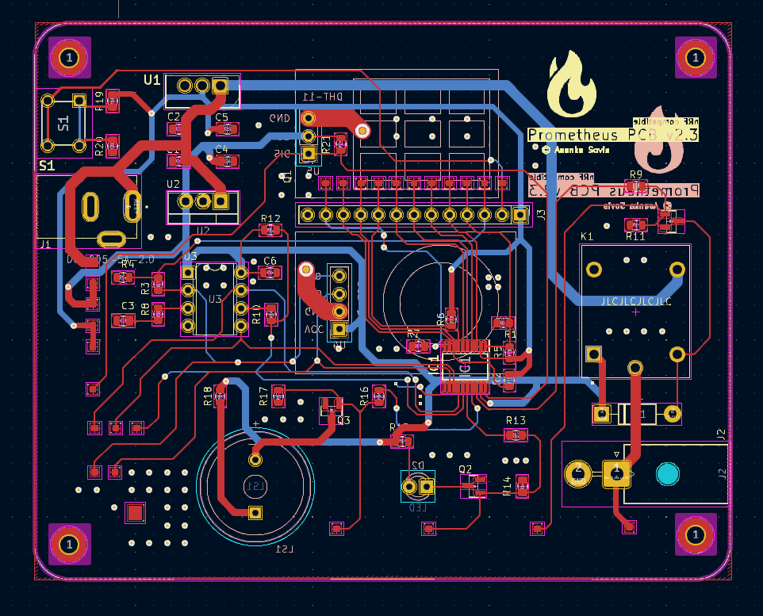

# Conclusion
Project Prometheus v2.0 turned into such an exciting and inspiring pet project for me. It encouraged me to learn so many new things and to experiment with things that I never would've had access to before. On this submission day, I'm confident about what I managed to achieve with this project. Prometheus came so far; yet there's more to look forward to. I'm excited and looking forward to seeing where Project Prometheus will go in the future. After a small break, I will be back with its development.

> 
> View of the PCB design of Prometheus PCB

## Thanks
This four-month journey was a journey filled with a lot of ups and downs. I would not be able to achieve this level of improvement without the help of countless people. The biggest support came from the people at my former workplace who encouraged, advised, continuously asked about the progress and even offered technical guidance and help.
This goes without mentioning the awesome people who helped me whenever I posted dumb questions on the [Nordic DevZone](https://devzone.nordicsemi.com/) forum and Discord server. Thank you for tolerating my newbie questions and annoying mistakes.

Thanks to the people who had been posting content on Youtube and other platforms guiding people through Matter, the nRF platform, Zephyr and related fields. Without you, this project would not be able to flourish.
Finally to the awesome people at Nordic Semiconductors and Hackster.io for organizing such a valuable opportunity. I would never have been able to afford to own something like nRF7002 DK if not for this project. Thank you for allowing me to enter into this world of innovative technology.