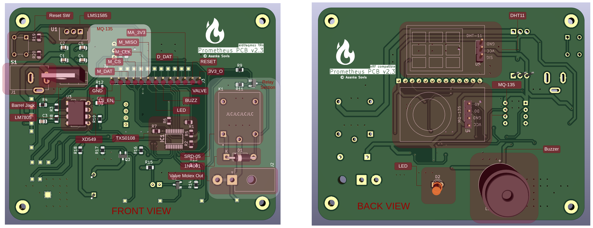
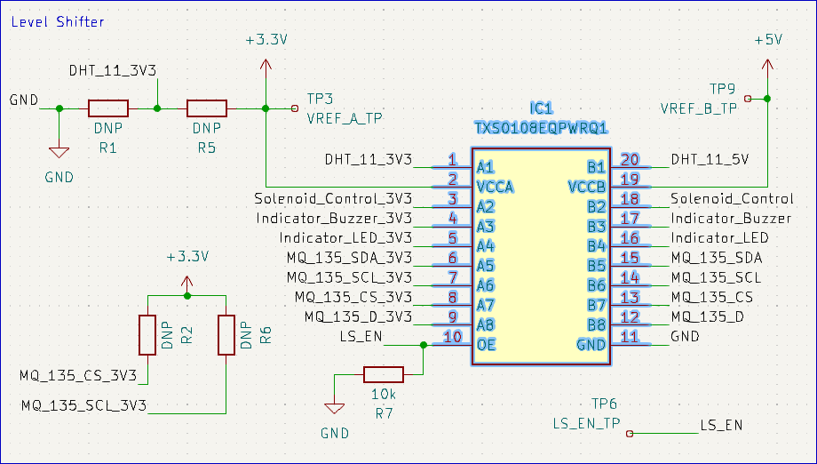
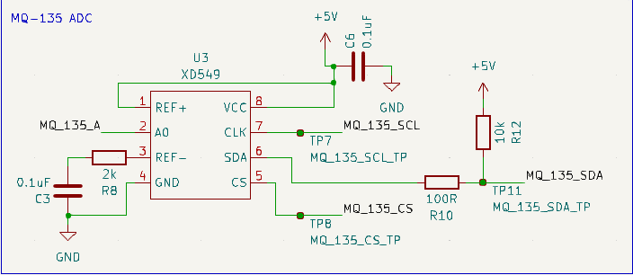
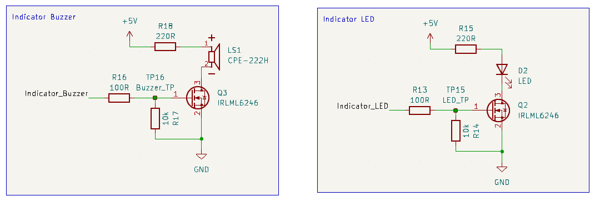
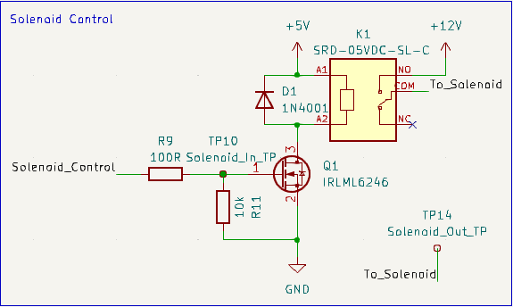
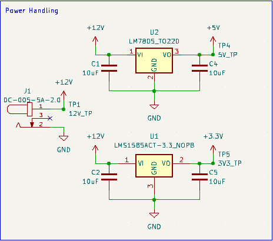
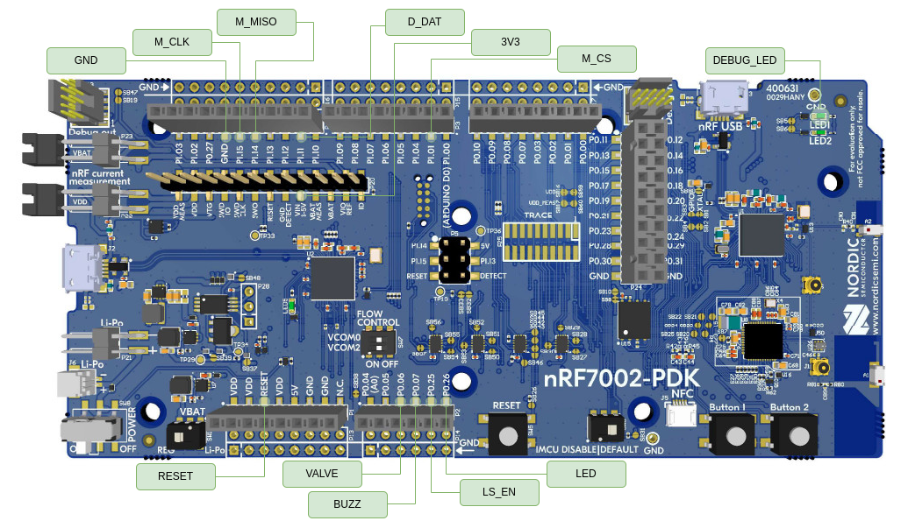
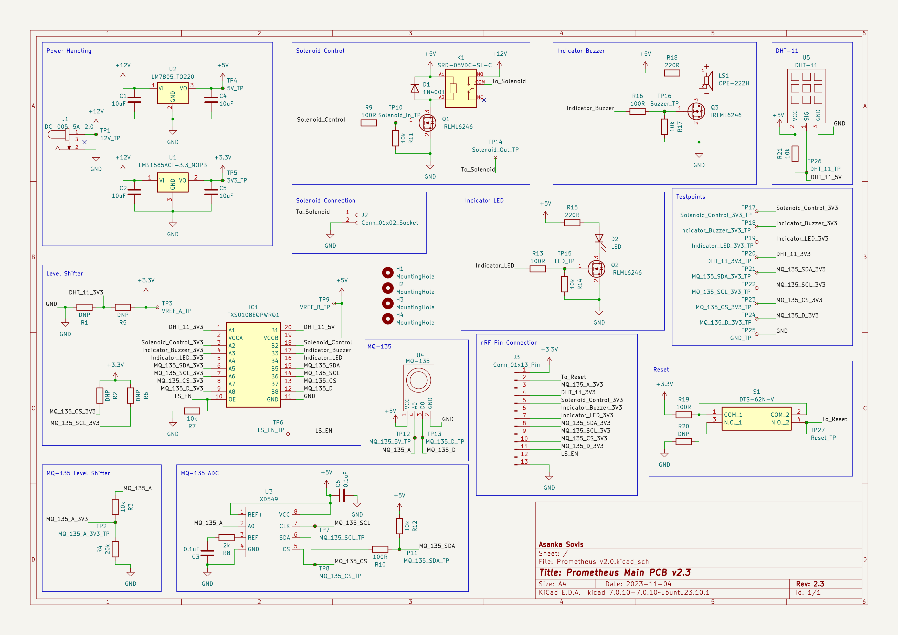

# Hardware Specification
The PCB of the Prometheus Fire Alarm System was designed and developed in-house. The PCB is a double layer PCB with sensors and indicators on the bottom and the rest of the components at the top. The PCB was manufactured and assembled by JLCPCB and the cost breakdown can be found in the [Bill of Material](./Bill_of_Material.md) section.
## Interface
> 
> PCB layout on both sides

The interface between the Prometheus PCB and the nRF7002 DK is the most important part of the whole hardware design. This is why every control signal from the board is sent from a single location throughout the board. All of these signal have probing locations attached for debugging purposes. The pins are situated in the following order from left to right.

1. GND - Common ground.
2. LS_EN - Enable the level shifter. Active high, this pin has to be pulled up for the whole PCB to start working.
3. M_DAT - Digital out of the MQ-135 sensor. This is not used as the reading is sent through the ADC.
4. M_CS - Chip Select for the ADC recording the MQ-135 readings.
5. M_CLK - Clock signal for the ADC recording the MQ-135 readings.
7. M_MISO - Master In Slave Out for the ADC recording the MQ-135 readings.
8. LED - LED control signal.
9. BUZZ - Buzzer control signal.
10. VALVE - Valve control signal.
11. D_DAT - Data out of the DHT-11 sensor.
12. MA_3V3 - 5V analog output of the MQ-135 sent through a voltage divider to translate to a 3.3V output. This is here for experimental purposes and not used.
13. RESET - Reset signal from the reset button.
14. 3V3_O - 3.3V output to power the nRF7002 DK.

## Signalling
The nRF 7002 DK operates with standard 3.3V, however, the logic on the board is designed to operate in the 5V. This is because almost all the components used are 5V components. Thus all the logic goes through the TXS0108EQ Level Shifter. This translates the 3.3V signal from the nRF end to 5V on the PCB end and vice versa. The TXS0108EQ has the following structure.

> 
> The structure of the level shifter layout on the PCB

By enabling the chip by pulling the LS_EN up, we turn on the TXS0108EQ for communication with the PCB. Firmware details of this operation can be found in the [Software Specifications](./Software_Specifications.md) section.

## DHT-11 Reading
The DHT-11 uses UART to communicate with the controller. Therefore, the device only needs one data line to go to the microcontroller. As discussed, this line is simply routed through the level shifter to the nRF board.

## MQ-135 Reading
The MQ-135 is a bit more tricky. It has two signals coming out. One is the analog reading while the other is a digital one. Digital signal goes high when the analog signal reaches a certain threshold which can be set by the pot on the sensor itself. However, I wanted to get the analog reading to the nRF board and only use the digital pin as a backup.

Thus, the digital pin was simply routed through the level shifter and not used. This left me with the option of how to use the analog signal of the MQ-135. Using the ADC of the nRF means I have to step down the voltage to 3.3V which is not ideal for an analog signal. Therefore, I opted to use a voltage divider circuit just as another backup and sent this output directly to the nRF. However, if you check carefully, this is never used.

This is because I used a 5V ADC instead to take the reading of the MQ-135 and send it to the nRF as an SPI signal.

> 
> The XD549 ADC used for the MQ-135 analog signal

The XD549 is a 5V ADC and it sends the reading to the host controller as an SPI signal. For this we have three signal lines: CS, SDA (MISO) and CLK. Since the XD549 is a 5V device, these data lines have to be level shifted through the level shifter as well and since these are only carrying digital signals, there's no need to worry about shifting levels anymore. Firmware details of this operation can be found in the [Software Specifications](./Software_Specifications.md) section.

## Digital Output Devices
The PCB also features three digital IO devices. The buzzer and LED are quite straightforward and the circuit is simple. The signal from the nRF is passed through the level shifter to the IRLML6246 MOSFET and the MOSFET drives these two outputs.
> 
> Indicator LED and Buzzer design

The valve operates in pretty much the same way but the MOSFET does not drive the valve directly. The valve is a high current device and thus needs a relay for its operation. For this reason, the MOSFET drives a relay and that relay is what drives the valve in turn. The valve is connected via a MOLEX connector to the board.
> 
>
> Valve control design

## Powering Up the System
The device needs to operate in three main voltage levels: 12V, 5V and 3.3V. The valve is controlled by a 12V signal, the nRF operates at 3.3V and the rest of the components operate at 5V. This means that 12V should come into the board as this is the highest required voltage level. In order to get the other two voltage levels, LM7805 and LMS1585 voltage regulators are used respectively for 5V and 3.3V. 
> 
>
> Power supply for the PCB

The 12V can be provided through a 12V power supply and the device operates well below 500mA of current which makes it possible to use any 12V power supply. A typical power supply in this range comes with a barrel jack so the PCB has a barrel jack power input.

## Resetting the Device
The reset button simply connects the 3.3V to the reset of the nRF board. This allows for resetting the device from the PCB itself.

## The nRF 7002 DK
All required signals from the interface connect directly to the nRF 7002 DK as shown below.
> 
> nRF 7002 DK interface pins *(Source: [developer.nordicsemi.com](https://developer.nordicsemi.com/nRF_Connect_SDK/doc/2.2.0/nrf/_images/nrf7002dk.jpg))*

The built-in LED 01 is also used for debug messaging. The default SPI line 3 of the SoC is used for the ADC while the rest of the GPIO was selected for convenience. 3.3V and GND from the power supply is also provided to the board from their respective pins. Additionally, the reset pin is also used however, in debug mode, this cannot be used. Firmware details of the operation of the nRF 7002 DK can be found in the [Software Specifications](./Software_Specifications.md) section.

## Schematic
> 
> The complete schematic view of the Prometheus PCB

The complete schematic of the PCB is given in the above diagram. This is available in the `Hardware/Prometheus v2.0` directory of the repository. The design was done using KiCad and all components used were available at JLCPCB at the time of manufacture. The complete Bill of Material and cost breakdown can be found in the [Bill of Material](./Bill_of_Material.md) section.