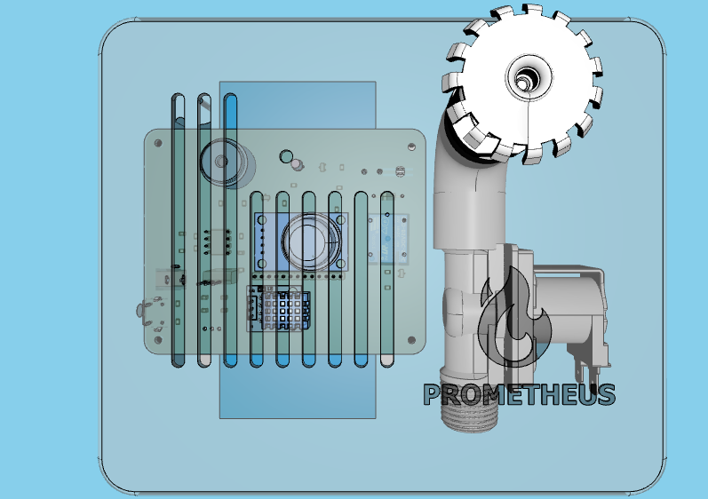
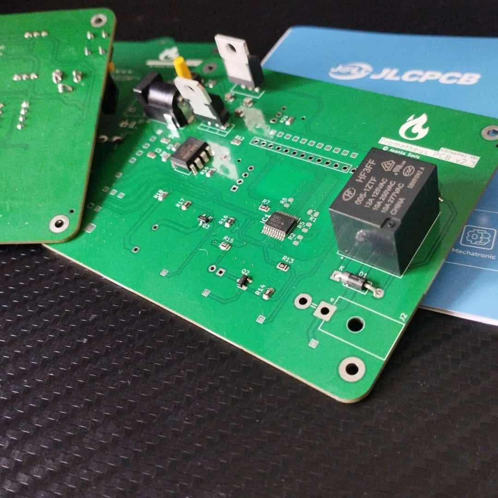
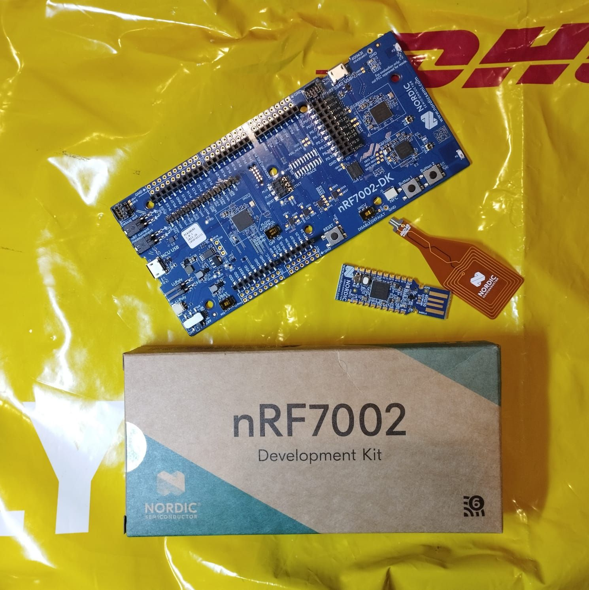

# Introduction
> 
> 3D view of the enclosure design

**Prometheus Fire Alarm System** is a fire alarm system and an extinguishing system that allows real-time monitoring via software. It can perform smart extinguishing on-site while simultaneously providing connectivity to multiple devices via the control panel. Prometheus is designed to be as simple and resilient as possible while making it safe to use and operate within a household.

**Prometheus 2.0** is the next generation of [Prometheus Fire Alarm System](https://github.com/asankaSovis/prometheus-fire-alarm); the future of household safety and monitoring. Developed on the nRF7002 platform, it brings all the features of v1.0 to the nRF platform along with additional features made possible by the nRF platform.

> 
> First demo of the Prometheus Fire Alarm System v2.0 in operation

## Project Overview
The project spanned from October 5, 2023, to January 14, 2024. Since, enrolling on the project, I have been tirelessly working on the development of the Prometheus Fire Alarm System. Since its inspection, it has been one of my pet projects that I did in my free time after completing it as a project for the university. It brought me a lot of knowledge, experience and fun. The Make it Matter contest had been a great opportunity for me to share my pet project with the world, and to integrate it with a well-renowned platform such as the nRF platform.
Juggling between academic work, full-time employment and personal life, I am proud of my achievements. However that I have come up with. However, I still feel like there's a long way for Prometheus to go.

> 
> First look at the Prometheus PCB v2.0 after arriving from JLCPCB

## The Journey and the Future
The journey started without any idea about Nordic, nRF or Matter. With limited access to resources and a limited budget, the project continued with days of researching online to discussing in online forums. However, with this limited budget and time, I am proud of what I've achieved. It had been a great opportunity to work with the nRF platform.

This will not be the end of my journey with Nordic or the nRF platform as I have planned to continue the devlog of the Prometheus Project. I also have tutorials planned on the issues I faced while working on this platform. One of the biggest hurdles I faced was the limited availability of resources online and outdated information. nRF and Matter are evolving rapidly but the internet has not yet been able to keep up with this growth and expansion. I'd like to pay my part and share my knowledge with others in hopes that they might not run into the same issues that I had to face.

In terms of Project Prometheus, there is a lot of work planned, even after the end of the **Make it Matter** contest. And I welcome everyone to continue the journey on [my Blog](https://asanka.hashnode.dev/).

> 
> First look at the nRF7002 DK