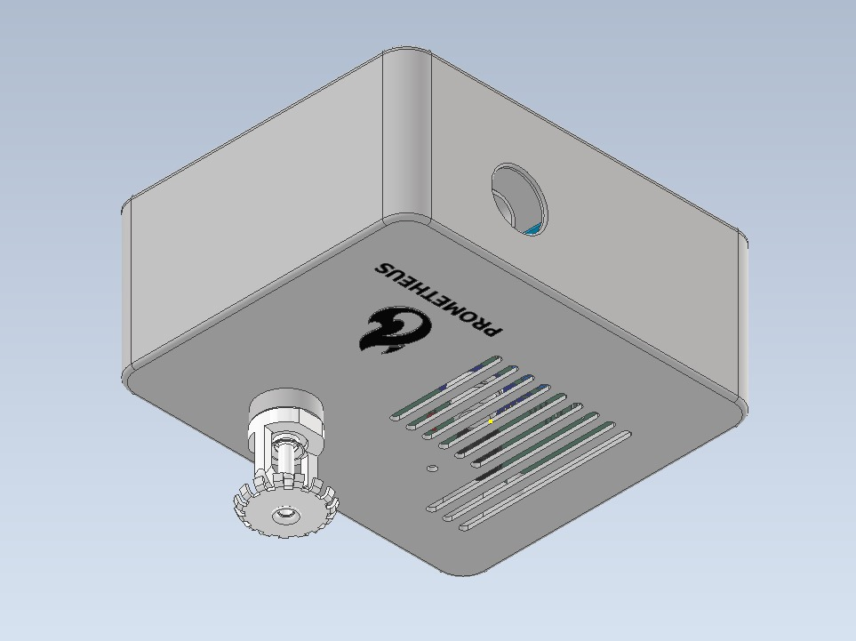

# Preface
One of the key requirements for a smart home is the safety and well-being of the inhabitants.  This is why it's important to have devices to actively monitor and rectify any threats that occur within the house. One such threat is the hazard of fire. According to the WHO, more than 300,000 deaths occur every year due to fire-related hazards [1](https://scholar.google.com/scholar_lookup?journal=MMWR:+Morbidity+and+Mortality+Weekly+Report&title=Prevention.+Deaths+resulting+from+residential+fires+and+the+prevalence+of+smoke+alarms--United+States,+1991-1995&author=CfD+Control&volume=47&issue=38&publication_year=1998&pages=803-6&pmid=9776167&).

Thus we see the importance of incorporating a fire monitoring and extinguishing system into the modern smart home. This should actively monitor the environment for critical changes in the levels of humidity, temperature and carbon dioxide and take necessary precautions to rectify any fires that get detected. The residents should also get the convenience of actively monitoring the state of the alarm and extinguishing system whenever they require it. This is the premise of the Prometheus Fire Alarm System v2.0.

> 
> Final assembly render