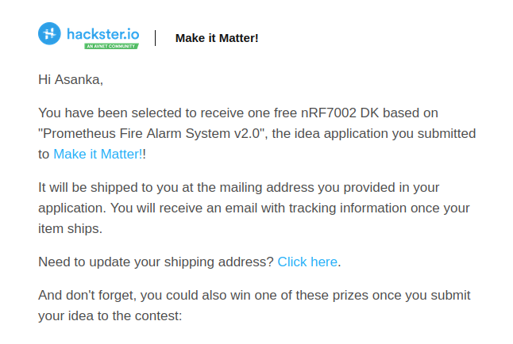
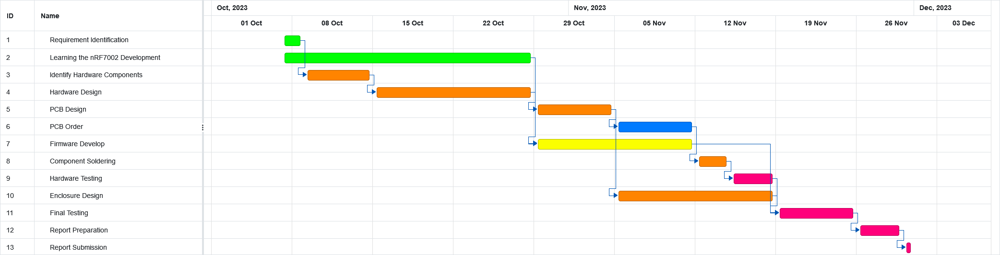

# Project Management
## Development So Far
The project started with a proposal outlining the problem, intended solution and its development strategy. This can be found in the [Project Prometheus v2.0](./Project_Prometheus_v2.0.md) document. Using this, hardware request was applied on September 20, 2023. On September 25, 2023 an email was received with the news that the Prometheus Fire Alarm System v2.0 was selected as a recipient for free hardware.

> 
> Email received announcing the selection to receive hardware

With this, a project timeline was created to better optimize the limited time I have. 

> 
> Project timeline

However, keeping up with this schedule proved to be extremely hard as I was treading in new territory. Thanks to the extension provided until January 14, 2024, the project managed to continue on. The final report was submitted on January 14, 2024.

## Project Status
After the final submission of the report, the state of the project is as follows.

- Requirement identification ✔️
- Learning the nRF 7002 development ♻️
- Identify hardware components ✔️
- Hardware design ✔️
- PCB design ✔️
- PCB order ✔️
- Firmware development ✔️
- Integrating matter protocol ♻️
- Component soldering ✔️
- Hardware testing ✔️
- Enclosure design ✔️
- Final testing  ♻️
- Report preparation ✔️
- Report submission ✔️

## Identified Issues with the Project
The following issues are mainly highlighted after analyzing the current state of the project.

- Unpublished articles in the Hashnode backlog
- Damaged MQ-135 sensor while hardware testing
- Matter integration incomplete
- Not enough knowledge and experience with nRF
- Not enough testing completed

## Future of the Project
After a small break from the project, my plan is to start rectifying these issues and adding more features to the design.

- Complete the [nRF Connect SDK Fundamentals](https://academy.nordicsemi.com/courses/nrf-connect-sdk-fundamentals/) course
- Complete integrating matter protocol to the project
- Replace MQ-135 gas sensor
- Replace DHT11 with Bosch BME280
- Publish and complete backlog of Hashnode articles
- Continue testing the system
- Write redesigned command panel using Flutter to be cross-platform and supporting both serial communication and matter network