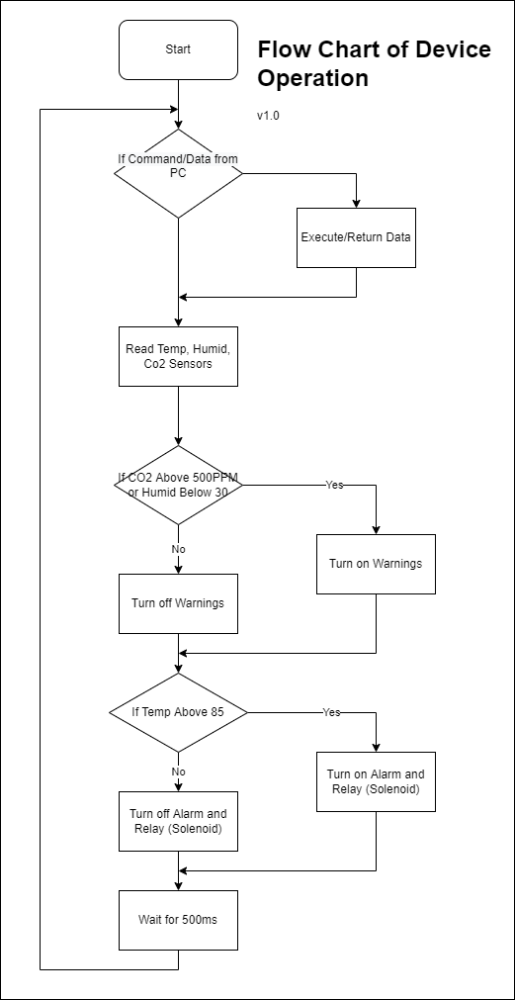
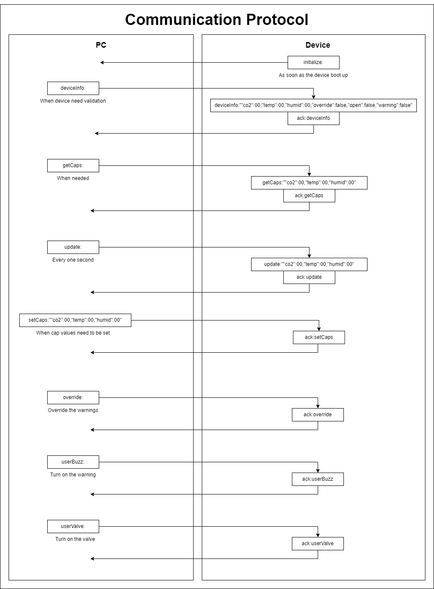
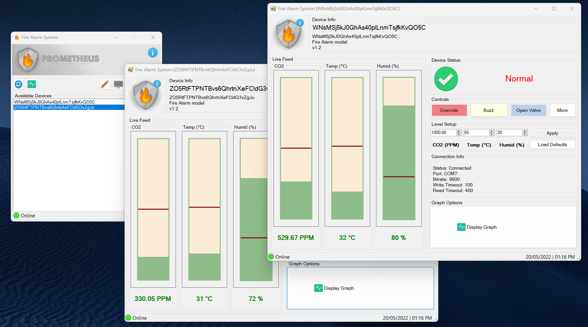
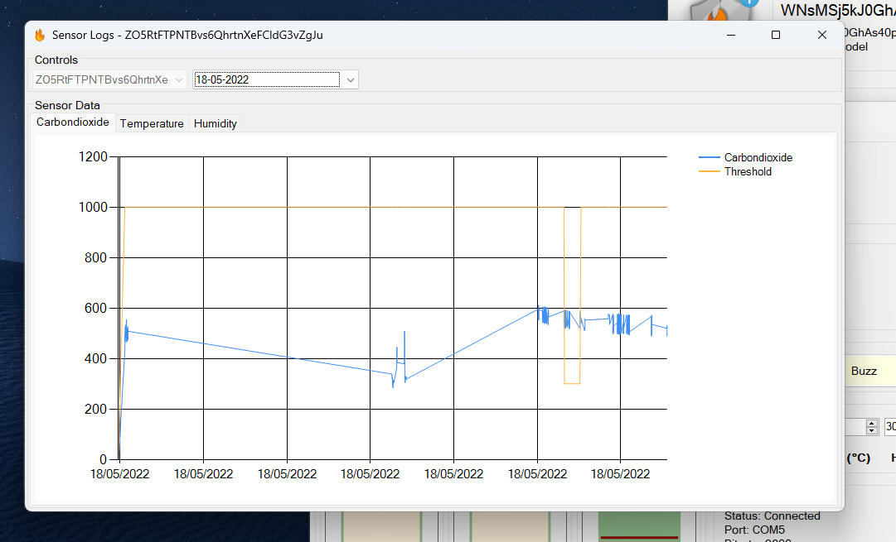
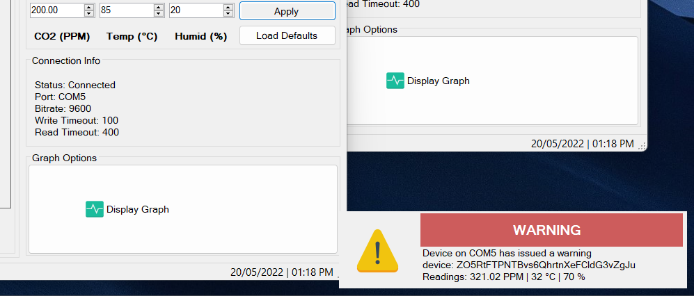

# Software Specification
The firmware of the Prometheus fire alarm system is developed entirely on the nRF Connect SDK. It uses Zephyr as the RTOS of choice and incorporates the device tree for hardware interfacing. It uses the SPI3 line of the nRF 5340 SoC for interfacing with the ADC. The rest of the IO connect to different signals in the PCB. The detailed breakdown is as follows.

- **GND -> GND** (Common grounding)
- **P1.15 -> M_CLK** (The clock of the  SPI 3 of the 5340 SoC to the Clock of the ADC)
- **P1.14 -> M_MISO** (MISO of the SPI 3 of the 5340 SoC to the SDA of the ADC)
- **P1.11 -> D_DAT** (Data signal from the DHT-11)
- **VIN 3-5V -> 3V3** (3.3V power supply to the nRF 7002 DK from the Prometheus PCB)
- **P1.01 -> M_CS** (Chip select GPIO from SoC to the CS of the ADC)
- **P0.26 -> LED** (GPIO to the LED control)
- **P0.25 -> LS_EN** (GPIO to the enable of the level shifter)
- **P0.07 -> BUZZ** (GPIO to the buzzer control)
- **P0.06 -> VALVE** (GPIO to the valve control)
- **RESET -> RESET** (Reset signal from the Prometheus PCB to the SoC)

The hardware layout of these pins within the Prometheus PCB and the nRF7002 DK can be found in the [Hardware Specifications](./Hardware_Specifications.md) section. Technical specification can be found in the [Technical Specifications](./Technical_Specifications.md). Additionally, the built-in LED 01 is used for debugging.

## Addressing and Configuration
The GPIO of the 5340 SoC has two 32bit GPIO addresses. Some of these are used internally, while the rest are usable. Each of the used pins are configured as follows.

- **P1.11** -> GPIO_PULL_UP | GPIO_ACTIVE_LOW
- **P0.25** -> GPIO_OPEN_SOURCE
- **P0.26** -> GPIO_OPEN_DRAIN
- **P0.06** -> GPIO_OPEN_DRAIN
- **P0.07** -> GPIO_OPEN_DRAIN
- **P1.01** -> GPIO_ACTIVE_HIGH | GPIO_OPEN_DRAIN

## Programming
The operation of the device starts with the initialization and checking if the device is ready. If not the built-in LED will periodically blink every second and try to reinitialize all components. Once done, the built-in LED will switch to flashing every ten second. At this stage, the sensor readings are read every 500ms and determined to see if critical levels are reached. If so, the warning is issued or valves are opened depending on the scenario. Additionally, if the user requested custom valve open or warning issue, this is also done. The operational flow chart of the device is given below.

> 
> Operational flowchart of the device

## Serial Protocol
The serial protocol is also an important aspect of the device. It allows the device to communicate with the Control Panel. All communication happen via the Micro USB interface of the nRF and USB port of a PC. The device communicate from its end via the COM ports while the device communicate from its end via the internal Zephyr UART. The communication is carried out in JSON. The communication protocol can be summed up as follows.
> 
> Communication protocol

## Monitoring and Controlling the Device
The Control Panel was written in C#. This program uses Windows APIs to connect to the COM ports of the computer to identify Prometheus devices connected. It has the following features.
- Connect multiple devices and add alias names to them for easy identification
- Monitor all sensor data from the devices from dedicated control panels
- Notifications for critical events
- Override warnings and control devices right from the PC
- Log sensor readings, visualize and export them
- Automatic reconnecting
> 
> 
> 
> Screenshots from the command panel

Further information on the project progress can be found in [Project Management](./Project_Management.md) section.
