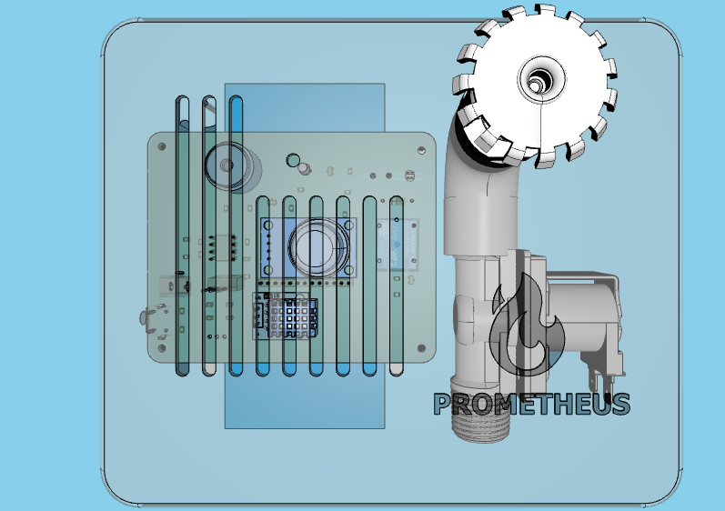

# 🔥 Project Prometheus v2.0

---

💸 Please consider donating on [Paypal](https://www.paypal.com/donate/?hosted_button_id=4EWXTWQ9FUFLA) to keep this project alive.

**Prometheus Fire Alarm System** is a fire alarm system and an extinguishing system that allows real-time monitoring via software. It can perform smart extinguishing on-site while simultaneously providing connectivity to multiple devices via the control panel. Prometheus is designed to be as simple and resilient as possible while making it safe to use and operate within a household.

**Prometheus 2.0** is the next generation of [Prometheus Fire Alarm System](https://github.com/asankaSovis/prometheus-fire-alarm); the future of household safety and monitoring. Developed on the nRF7002 platform, it brings all the features of v1.0 to the nRF platform along with additional features made possible by the nRF platform.

> 
> 3D view of the enclosure design

## 📜 License
> Project Prometheus v2.0 is licensed under the **GNU General Public License v3.0**.

Permissions of this strong copyleft license are conditioned on making available complete source code of licensed works and modifications, which include larger works using a licensed work, under the same license. Copyright and license notices must be preserved. Contributors provide an express grant of patent rights.

### Permissions
✔️ Commercial use | Modification | Distribution | Patent use | Private use

### Limitations
❌ Liability | Warranty

### Conditions
ℹ️ License and copyright notice | State changes | Disclose source | Same license 

Refer to the [License declaration](./LICENSE) for more details.

## 💾 Documentation
Please refer to the following links for different sections of documentation.

1. [Preface](./Documentation/Preface.md)
2. [Introduction](./Documentation/Introduction.md)
3. [Technical Specification](./Documentation/Technical_Specifications.md)
4. [Hardware Specification](./Documentation/Hardware_Specifications.md)
5. [Software Specification](./Documentation/Software_Specifications.md)
6. [Operational Details](./Documentation/Operational_Details.md)
7. [Project Management](./Documentation/Project_Management.md)
8. [Bill of Material](./Documentation/Bill_of_Material.md)
9. [References](./Documentation/References.md)
10. [Conclusion](./Documentation/Conclusion.md)

## 📊 Demonstration

> 
> Demonstration video of the final product

`© 2024 Asanka Sovis`